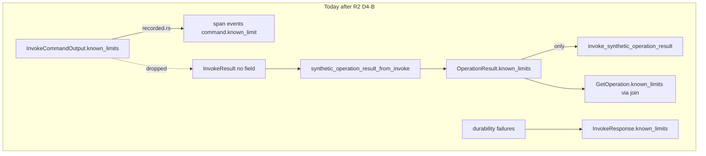

# API-R2c: known_limits Plumbing Decision Review

**Date:** 2026-06-30  
**Status:** **owner accepted Package A (D4-B freeze)** — final decision record.
Does not approve **API-R2c-impl**. P14 pause boundary unchanged.

## One-line summary

API-R2c decides one narrow question: should command-emitted
`InvokeCommandOutput.known_limits` flow into persisted synthetic
`OperationResult.known_limits` on the session invoke synthetic path?  
**Owner answer: no** — command limits remain trace-only; synthetic artifact
keeps honesty marker only. This is smaller than API-R2b and independent of
invoke-surface parity.

## Owner freeze block

```text
command known_limits：trace-only（command.known_limit span events）
persisted OperationResult.known_limits：synthetic marker only（durability 不上 artifact）
InvokeResponse.known_limits：durability-only
R2c-impl：frozen unless owner reopens with Package B + named consumer
```

### English expansion (for reviewers)

| Statement | Meaning | Evidence |
| --- | --- | --- |
| Command limits trace-only | `InvokeCommandOutput.known_limits` land as span events only; not merged into persisted `OperationResult` | [`recorded.rs`](../../crates/auv-cli-invoke/src/recorded.rs) |
| Artifact marker only | Session synthetic `OperationResult.known_limits` carries `invoke_synthetic_operation_result` only | [`operation_result_store.rs`](../../src/api/session_service/operation_result_store.rs) |
| Invoke durability-only | `InvokeResponse.known_limits` surfaces persist failures only, not command honesty | [`mapper.rs`](../../src/api/session_service/mapper.rs), [`handler.rs`](../../src/api/session_service/handler.rs) |
| R2c-impl frozen | No `InvokeResult` field change or merge plumbing unless owner signs Package B | This note |

## Slice classification

| Item | Value |
| --- | --- |
| This note (API-R2c) | **docs-only** |
| Follow-on code (API-R2c-impl, if approved) | **owner-approved feature** |
| Not | bug fix, test-only, narrow refactor |

## Why this slice now



- R1 deferred D4 as **D4-B**; R2 landed with synthetic marker + durability
  limits only.
- R2b explicitly defers **API-R2c** for command-limit plumbing.
- R2c is orthogonal to R2b: parity is *where* persist runs; R2c is *what* goes
  into persisted `OperationResult.known_limits`.

## Evidence the review must document

### Three sinks today

| Sink | What lands | Code |
| --- | --- | --- |
| **Trace** | Each command limit as `command.known_limit` span event | [`recorded.rs`](../../crates/auv-cli-invoke/src/recorded.rs) |
| **`InvokeResponse.known_limits`** | Durability gaps only (`operation_summary_persist_failed`, `operation_result_persist_failed`) | [`handler.rs`](../../src/api/session_service/handler.rs), [`mapper.rs`](../../src/api/session_service/mapper.rs) |
| **Persisted `OperationResult.known_limits`** | Synthetic honesty marker only | [`operation_result_store.rs`](../../src/api/session_service/operation_result_store.rs) |

### Structural gap

- [`InvokeResult`](../../crates/auv-cli-invoke/src/model.rs) has **no**
  `known_limits` field — limits are lost after `recorded.rs` maps
  `InvokeCommandOutput` → `InvokeResult`.
- Catalog commands **do** emit limits (e.g. `fixture.rs`, `window.rs`,
  `screen.rs`, `display.rs`, `input.rs`, `app.rs`).
- [`mapper.rs`](../../src/api/session_service/mapper.rs) already treats proto
  `known_limits` as `OperationResult`-sourced on `GetOperation`; invoke path
  stays empty except durability.
- [`GetOperation` join](../../src/api/session_service/summary.rs) clones
  `operation.known_limits` from the persisted artifact. Command limits do not
  appear on wire today after session invoke.

### Typed vs synthetic contrast

- Typed `OperationResult` producers set domain `known_limits` intentionally.
- Session synthetic path currently **replaces** with a single marker — no merge
  with command output.

## Owner decision (D4 reframed for R2c)

| Option | Meaning |
| --- | --- |
| **D4-B Freeze (recommended default)** | Command limits stay trace-only; persisted synthetic record keeps marker (+ durability on invoke RPC only) |
| **D4-A Accept plumbing** | Merge command `known_limits` into persisted `OperationResult.known_limits` on session invoke synthetic path |

### Case for D4-B (freeze)

- Limits already durable in **trace** (`command.known_limit` events) — inspect
  can read run spans.
- Smallest slice; no `auv-cli-invoke` API change; aligns with R1/R2/R2b pause
  discipline.
- `InvokeResponse.known_limits` stays **durability-only** — avoids mixing
  command honesty with partial-success semantics.
- Catalog invoke limits are often command-specific prose, not stable contract
  tokens — risky to treat as authoritative `OperationResult` data without a
  versioning policy.

### Case for D4-A (plumb)

- `GetOperation` clients expect `known_limits` on wire per API-P3 two-source
  model; today `fixture.observe` limit is invisible on `GetOperation`.
- Inspect/read paths that use `read_operation_result` see only the synthetic
  marker — asymmetric versus typed producers.
- Span-event indirection is harder for API consumers than first-class artifact
  fields.

**Reviewer recommendation to encode:** **D4-B freeze** unless owner names a
**GetOperation** or inspect consumer that requires command limits on
`OperationResult` artifact (not trace).

## Candidate API-R2c-impl slice (not approved here)

If Package B is approved later, the narrowest honest implementation is:

| Plumbing option | Owner | Pros | Cons |
| --- | --- | --- | --- |
| **A1** Extend `InvokeResult` with `known_limits: Vec<String>` | `auv-cli-invoke` + session builder | Clean; limits survive invoke boundary | Crate API change; all `InvokeResult` constructors |
| **A2** Pass limits into `synthetic_operation_result_from_invoke` at handler only | Requires limits available at handler | Narrower than A1 if limits threaded ad hoc | Insufficient alone — limits are dropped before handler unless recorded path changes |
| **A3** Reconstruct from span `command.known_limit` events at persist time | `operation_result_store` | No `InvokeResult` change | Fragile; couples persist to trace shape |

**If D4-A:** recommend **A1** (extend `InvokeResult`) + merge policy in
`synthetic_operation_result_from_invoke`:

```text
known_limits = [synthetic_marker] ++ command_limits (deduped, stable order)
```

Durability limits stay on **`InvokeResponse` only** (do not mix into artifact on
persist failure — P11 policy).

### R2c-impl non-goals

- R2b MCP/CLI parity
- P10 stream, proto field additions
- Plumbing into `operation-summary` artifact
- Changing typed producer `known_limits` semantics
- `run_read` join policy changes beyond reading richer artifact JSON

### R2c-impl validation (candidate)

```sh
cargo fmt --check
cargo check
cargo test session_service
cargo test operation_result_store
git diff --check
```

Add regression: session invoke of `fixture.observe` → `GetOperation` includes
command limit string in `known_limits` (if D4-A).

## Anti-misread rules

1. **R2c ≠ R2b** — limits plumbing does not require MCP/CLI persist parity.
2. **Durability limits ≠ command limits** — `operation_*_persist_failed` are
   invoke-path partial-success signals, not command honesty.
3. **Synthetic marker stays** — Package A keeps marker only; no command merge
   into artifact.
4. **Trace still authoritative for deep inspect** — artifact plumbing was
   rejected; span events remain the command-limit read path.
5. **R2c freeze ≠ R2b freeze** — R2b parity decision remains separate
   ([R2b review](2026-06-30-auv-api-r2b-invoke-surface-parity-decision-review.md)).
6. **Signing R2c Package A does not sign R2b Package A** — independent owner
   decisions.
7. **R2c freeze ≠ R2c-impl auto-start** — Package B + named consumer required
   to reopen.
8. **Does not unlock P10 / MCP merge** — P14 pause boundary unchanged.

## Owner decision packages

### Package A — Keep D4-B freeze (**accepted**)

**Accepted: 2026-06-30, Package A** — matches reviewer recommendation (D4-B
freeze).

```text
R2c-A  Freeze: command known_limits remain trace-only for catalog invoke
R2c-B  Persisted synthetic OperationResult keeps marker (+ no command merge)
R2c-C  InvokeResponse.known_limits remains durability-only
R2c-D  Document trace read path for command limits (command.known_limit events)
```

### Package B — Approve API-R2c-impl (D4-A) — **not accepted**

```text
R2c-A  Merge InvokeCommandOutput.known_limits into persisted OperationResult
R2c-B  Plumbing via InvokeResult field (A1) — not span reconstruction (A3)
R2c-C  Merge policy: marker + command limits; dedupe; durability stays on InvokeResponse
R2c-D  Session invoke path only (same boundary as R2 D2-A)
```

Candidate implementation remains in **Candidate API-R2c-impl slice** above for
future owner reopen only.

## Open questions — resolved (Package A)

| # | Question | Package A resolution |
| --- | --- | --- |
| 1 | Command limits on `InvokeResponse` at invoke time? | **No** — durability-only on invoke RPC; command limits trace-only |
| 2 | Merge order and dedup when limit duplicates marker? | **N/A** — no command merge into artifact |
| 3 | Empty command `known_limits`? | **Yes** — artifact carries synthetic marker only |
| 4 | Inspect consumer requires artifact limits vs span events? | **No evidence today** — trace path sufficient; reopen if named |

## Reopen triggers

| Trigger | Unlocks | Does **not** auto-unlock |
| --- | --- | --- |
| Owner names **Package B** + concrete GetOperation/inspect consumer | API-R2c-impl candidate only | R2b-impl, P10, MCP merge |
| Owner names **R2b-impl** | Invoke-surface parity only | R2c-impl, command-limit plumbing |

## Relationship to R1 / R2 / R2b / P14 pause

- **R1** decided the write-through split and left D4-B open until R2c.
- **R2** landed the synthetic session path only (marker + durability on invoke).
- **R2b** decides whether non-session invoke surfaces should mirror R2
  durability shape — **independent** of this R2c freeze.
- **P14** still pauses the line; R2c Package A freeze does not reopen P10 or
  MCP merge.

## Reader validation commands

```sh
rg -n "known_limits|command\\.known_limit" crates/auv-cli-invoke src/api/session_service
git diff --check
```
