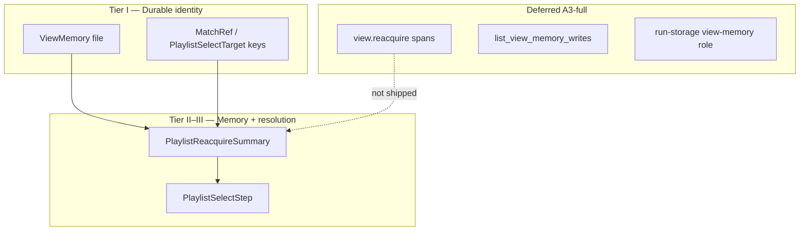

# SceneBridge A5: Inspect Identity Proof Charter

**Date:** 2026-06-30  
**Status:** **owner-approved A5 docs-only** — freezes which JSON / trace / inspect fields
count as identity proof vs run-time geometry or diagnostics on the NetEase playlist
sidebar path; does **not** implement trace spans, inspect read API, or run-storage
migration.

**Prior work:** [A4 closure](2026-06-30-auv-scenebridge-a4-closure.md) (stale outcome
landed) → this note locks inspect vocabulary before A3-full trace work.

## One-line summary

A5 defines four **proof tiers** for the shipped NetEase `playlist_sidebar` lane,
maps every field on `PlaylistSelectTarget`, `MatchRef`, `PlaylistReacquireSummary`,
`PlaylistSelectResult`, and artifact-dir `ViewMemory` to those tiers, and
explicitly defers `view.reacquire.*` spans, `list_view_memory_writes`, and A1 Q5
cross-app scope.

## Owner freeze block

```text
proof tiers：I durable identity keys | II memory/freshness | III run resolution | IV ephemeral geometry
shipped：playlist ls --json → MatchRef + scan；playlist select → PlaylistSelectResult JSON；artifact-dir view-memory-*.json
deferred：view.reacquire.* spans；Runtime::list_view_memory_writes；run-storage view-memory role
Q5：cross-app scope continues defer — com.netease.163music + playlist_sidebar only
```

### Proof tier definitions

| Tier | Name | Meaning |
| --- | --- | --- |
| **I** | Durable identity keys | Keys reusable across refocus / layout drift within a scope |
| **II** | Memory / freshness proof | Evidence that a specific memory snapshot was read and whether it was stale |
| **III** | Run resolution proof | How **this run** resolved a target to clickable bounds (reacquire / rescan) |
| **IV** | Ephemeral geometry | Layout- or scroll-dependent; must not be used alone as an identity key |

Tiers are defined in this charter only — not yet promoted to
[`TERMS_AND_CONCEPTS.md`](../../TERMS_AND_CONCEPTS.md) unless owner names a TERMS slice.

## Slice classification

| Item | Value |
| --- | --- |
| This note (A5 charter) | **docs-only** |
| Shipped surfaces audited | `auv-netease-music` CLI JSON + `auv-view::memory` artifact-dir JSON |
| Not | Rust, proto, MCP, trace span emission, inspect API impl |

## Shipped vs deferred surfaces

| Surface | Status | Tier coverage |
| --- | --- | --- |
| `playlist ls --json` → `MatchRef` + embedded `PlaylistSidebarScan` | **Shipped (A2–A3)** | I (target keys) |
| `playlist select` → `PlaylistSelectResult` JSON | **Shipped (A3–A4)** | I–III |
| `--artifact-dir` `view-memory-<scope_id>.json` | **Shipped (A3-min bridge)** | I–II |
| `view.reacquire.*` spans per [anchor-reacquisition-v0](2026-05-29-view-parser-anchor-reacquisition-v0.md) | **Not shipped** | Future II–III (field names align with `PlaylistReacquireSummary`) |
| `Runtime::list_view_memory_writes` per [inspect-viewer-v0](2026-05-29-view-parser-inspect-viewer-v0.md) | **Not shipped** | Future II |
| Implicit CLI `.auv` run recording with `view-memory` role | **Out of A5** | Do not claim runs already carry view-memory artifacts |



## Field matrices (shipped code)

Structs below match **landed** Rust types in `auv-netease-music` and `auv-view`
as of A4-min — not aspirational view-parser specs.

### `PlaylistSelectTarget` (`PlaylistSelectResult.target`)

Source: [`crates/auv-netease-music/src/lib.rs`](../../crates/auv-netease-music/src/lib.rs)

| Field | Tier | Identity proof? | Notes |
| --- | --- | --- | --- |
| `label` | I | **Yes** | Primary display key; normalized for match |
| `section_kind` / `domain_kind()` | I | **Yes** | Reacquire primary key with label; maps to `ReacquireTarget::LabelWithSection { section_hint }` |
| `anchor_id` | I | **Yes (when present)** | Target key; not alone sufficient (A3 anti-misread #9) |
| `section_id` | — | **Parse-scoped only** | Stable within one scan merge; not cross-run proof |
| `item_id` | — | **Parse-scoped only** | Same as A2 vocabulary — unique per scan until content-derived IDs |
| `candidate_id` | — | **No** | Parse-scoped; not `CandidateRef` |
| `observation_index` | IV | **No** | Scroll / viewport position |
| `bounds` | IV | **No** | Ephemeral window-local geometry |

### `MatchRef` (`playlist ls --json` matches)

Source: [`crates/auv-netease-music/src/output.rs`](../../crates/auv-netease-music/src/output.rs)

Same vocabulary as `PlaylistSelectTarget` for identity fields; different lifecycle
(**ls** produces → **select** consumes). Aligns with [A2 grounding vocabulary
table](2026-06-30-auv-scenebridge-a2-netease-sidebar-evidence-pack.md).

| Field | Tier | Identity proof? | Notes |
| --- | --- | --- | --- |
| `label` | I | **Yes** | Keyword filter + reacquire label key |
| `section_kind` | I | **Yes** | Section namespace for label+section match |
| `anchor_id` | I | **Yes (when present)** | Optional durable target hint |
| `section_id` | — | **Parse-scoped only** | Projection merge id within scan |
| `item_id` | — | **Parse-scoped only** | Not cross-run proof |
| `candidate_id` | — | **No** | Parse-scoped; optional on output |

Embedded `scan` (`PlaylistSidebarScan`) carries Tier IV geometry and parse-scoped
ids — inspect identity from `matches[]`, not raw observation bounds alone.

### `PlaylistReacquireSummary` (`PlaylistSelectResult.reacquire`)

Source: [`crates/auv-netease-music/src/view_memory.rs`](../../crates/auv-netease-music/src/view_memory.rs)

| Field | Tier | Identity proof? | Notes |
| --- | --- | --- | --- |
| `outcome` | II–III | **Resolution proof** | `reacquired` / `stale` / `not_found` — freshness + resolution state, not “who” |
| `stale_reason` | II | **Resolution proof** | e.g. `RegionGoneAtReacquisition`, `ObservationFailed` (A4 wire) |
| `strategy_used` | III | **Resolution proof** | Cascade stage label when hit |
| `observation_count` | III | **Resolution proof** | Live observes during reacquire |
| `skipped_rescan_replay` | III | **Resolution proof** | `true` when memory path avoided full scroll replay |

### `PlaylistSelectResult` (remaining fields)

Source: [`crates/auv-netease-music/src/commands/playlist.rs`](../../crates/auv-netease-music/src/commands/playlist.rs)

| Field | Tier | Identity proof? | Notes |
| --- | --- | --- | --- |
| `command`, `query` | — | **No** | Command context |
| `app`, `window` | — | **Context** | Bind app/window; not item identity |
| `target` | I–IV | See table above | Nested identity matrix |
| `reacquire` | II–III | See table above | Optional when gate off or miss |
| `steps[]` | III | **Resolution proof** | Delivery path (`reacquire-target`, scroll, click) |
| `steps[].name` | III | **Resolution proof** | Step label |
| `steps[].target_bounds` | IV | **No** | Ephemeral click geometry |
| `steps[].delivery_path`, `steps[].fallback_reason` | III | **Resolution proof** | How input was delivered |
| `verification` | — | **Semantic success** | Post-click title check; not identity |
| `verification.status`, `verification.method` | — | **Semantic** | Success/failure of play verification |
| `verification.observed_title`, `verification.artifact`, `verification.note` | — | **Semantic / diagnostic** | Not identity keys |
| `diagnostics` | — | **No** | Parser diagnostics; supplementary |
| `known_limits` | — | **No** | Human strings; not structured identity proof alone |

### `ViewMemory` (artifact-dir JSON)

Source: [`crates/auv-view/src/memory/mod.rs`](../../crates/auv-view/src/memory/mod.rs)

| Field | Tier | Identity proof? | Notes |
| --- | --- | --- | --- |
| `schema_version` | — | **Schema** | `view-memory-v0` |
| `memory_id` | I | **Yes** | `app_bundle_id:scope_id` stable key |
| `app_bundle_id` | I | **Yes** | App identity (`com.netease.163music`) |
| `scope_id` | I | **Yes** | Shipped `playlist_sidebar` |
| `anchors[]` (`id`, `label`, `strength`) | I | **Yes** | Durable anchor index; `bounds` on anchor is IV |
| `anchors[].evidence_ids` | III | **Parse/memory scoped** | Links to observation evidence |
| `node_snapshots` (`node_id` → snapshot) | I (partial) | **Content-derived keys** | `label`, `section_hint`, `domain_kind`; `node_id` parse/memory scoped |
| `node_snapshots[].bounds_window_local` | IV | **No** | Ephemeral |
| `node_snapshots[].last_seen_observation_index` | IV | **No** | Scroll position hint |
| `node_snapshots[].viewport_fingerprint_hint` | III | **Resolution hint** | Not durable identity alone |
| `landmarks[]` | I (partial) | **Structural hints** | Region landmarks; bounds are IV |
| `last_reconstructed_at_millis` | II | **Freshness input** | TTL / stale checks at reacquire entry |
| `scope_snapshot.baseline_width` | II | **Freshness input** | Layout drift detection (A4) |
| `scope_snapshot.region_bounds_window_local` | IV | **No** | Ephemeral region geometry |
| `source_reconstruction_ref` | III | **Provenance** | e.g. `playlist-scan-cache.json` |
| `source_run_id` | — | **Not run proof** | `ARTIFACT_DIR_BRIDGE_RUN_ID` placeholder (A3 #8) |
| `diagnostics` | — | **No** | Write-time parser notes |

### Trace / inspect API (normative vs shipped)

| Surface | Status | Maps to tier | Notes |
| --- | --- | --- | --- |
| `PlaylistSelectResult` JSON | **Shipped** | II–III | A3-min command JSON inspect path |
| `view.reacquire.attempt` / `view.reacquire.outcome` spans | **Not shipped** | II–III | Names should mirror `PlaylistReacquireSummary` when implemented |
| `view.memory.write` / `view.memory.read` spans | **Not shipped** | II | Deferred per A3 P7 |
| `Runtime::list_view_memory_writes` | **Not shipped** | II | [inspect-viewer-v0](2026-05-29-view-parser-inspect-viewer-v0.md) |
| Run artifact `view-memory` role | **Not shipped** | I–II | Run-storage migration → future slice |

**Alignment table (future spans ↔ shipped JSON):**

| Future span field (anchor-reacquisition-v0) | Shipped JSON field |
| --- | --- |
| `reacquire.outcome` | `reacquire.outcome` |
| `reacquire.strategy` | `reacquire.strategy_used` |
| `reacquire.stale_reason` | `reacquire.stale_reason` |
| `reacquire.observation_count` | `reacquire.observation_count` |

## Anti-misread rules (frozen)

1. **`bounds` and `observation_index` are not identity proof** — Tier IV ephemeral geometry.
2. **`candidate_id` ≠ durable `CandidateRef`** — parse-scoped optional field on `MatchRef` / `PlaylistSelectTarget`.
3. **`reacquire.stale_reason` proves memory/resolution state, not target identity** — Tier II; pair with Tier I keys to explain *who* was sought.
4. **`known_limits` strings alone are not structured identity proof** — human-readable supplements only.
5. **Command JSON proof ≠ run trace proof** — `PlaylistSelectResult` is shipped; `.auv` trace spans are deferred.
6. **Hermetic test JSON ≠ `proof_class: live`** — curated fixtures do not substitute for owner-labeled desktop proof (A3 #10).
7. **`source_run_id` bridge value is not a real run id** — `ARTIFACT_DIR_BRIDGE_RUN_ID` until run-storage lands.
8. **Q5 cross-app comparison is out of A5 scope** — vocabulary frozen for NetEase `playlist_sidebar` only; no QQ Music table.
9. **`anchor_id` alone is not sufficient** — label + `section_kind` / section hint is the primary cross-run key (A3 #9).
10. **`verification.status` proves semantic play success, not scene identity** — separate concern from tiers I–III.
11. **`item_id` / `section_id` stable within a scan ≠ cross-run durable keys** — honest parse-scoped semantics per A2.
12. **Reading `PlaylistSidebarScan` observation bounds for identity violates tier IV** — use `MatchRef` / `PlaylistSelectTarget` Tier I fields.

## A1 open questions — A5 resolution

| # | Question (A1) | A5 resolution |
| --- | --- | --- |
| 4 | Inspect contract — artifacts/trace for identity decisions? | **Partial → A5 doc freeze** for NetEase playlist path: tier tables + anti-misread; trace/inspect API implementation → future slice |
| 5 | Cross-app scope — same command class vs per-app namespaces? | **Deferred** — `com.netease.163music` + `playlist_sidebar` only; see [A1 charter](2026-06-30-auv-scenebridge-a1-design-charter.md), [A2 evidence pack](2026-06-30-auv-scenebridge-a2-netease-sidebar-evidence-pack.md) |

## Done checklist (A5 docs-only)

- [x] Charter md with proof tiers, field matrices, anti-misread rules
- [x] A4 closure / A1 charter / A3 boundary crosslinks
- [x] [`INDEX.md`](INDEX.md) `core/scenebridge` count 6 → 7
- [ ] `git diff --check`

## Explicit non-goals (A5)

- Rust / proto / MCP changes
- Emitting `view.reacquire.*` spans or implementing `list_view_memory_writes`
- Run-storage `view-memory` role migration
- Formal `TERMS_AND_CONCEPTS.md` term promotion (unless owner names TERMS slice)
- Q5 cross-app evidence or QQ Music comparison tables
- `CandidateRef` / surface-analyze promotion wiring
- Default-on `AUV_NETEASE_VIEW_MEMORY` or NOTICE removal

## Related

- [A6 live evidence closure](2026-06-30-auv-scenebridge-a6-live-evidence-closure.md)
- [A1 design charter](2026-06-30-auv-scenebridge-a1-design-charter.md)
- [A2 NetEase sidebar evidence pack](2026-06-30-auv-scenebridge-a2-netease-sidebar-evidence-pack.md)
- [A3 prototype boundary review](2026-06-30-auv-scenebridge-a3-prototype-boundary-review.md)
- [A4 closure](2026-06-30-auv-scenebridge-a4-closure.md)
- [anchor-reacquisition-v0](2026-05-29-view-parser-anchor-reacquisition-v0.md)
- [inspect-viewer-v0](2026-05-29-view-parser-inspect-viewer-v0.md)
- [view-memory-v0](2026-05-29-view-parser-view-memory-v0.md)
- [Evidence folder](evidence/2026-06-30-scenebridge-netease-sidebar/)
